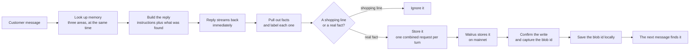

# Regent

**A grocery chat assistant that actually remembers you — because the memory is stored on Walrus.**

Regent is the ordering assistant for **Regency Stores**, a neighbourhood grocery in Yaba, Lagos.
There is no product page and no checkout, because that is not how this shop's customers buy. The
chat is the counter. Reggie takes the message, remembers what the customer says, and stores the
important parts in Walrus Memory on Sui mainnet — so what it knows survives the browser, the phone,
and whoever happens to be holding the phone that day.

Built for **Walrus Sessions 8: Chatbots That Remember**.


---

## Contents

- [The problem](#the-problem)
- [What Regent does](#what-regent-does)
- [How it works](#how-it-works)
- [Where the memories are kept](#where-the-memories-are-kept)
- [Proof of writes on Walrus mainnet](#proof-of-writes-on-walrus-mainnet)
- [The model](#the-model)
- [What the model does, and what it never does](#what-the-model-does-and-what-it-never-does)
- [Asking for something is not a preference](#asking-for-something-is-not-a-preference)
- [Screens](#screens)
- [How the data is stored](#how-the-data-is-stored)
- [Tech stack](#tech-stack)
- [Running it yourself](#running-it-yourself)
- [Testing](#testing)
- [Project layout](#project-layout)
- [Known limitations](#known-limitations)

---

## The problem

Regency Stores sells the same basket to the same people, week after week. That repetition is the
whole business. A grocery in Yaba does not live on one big order; it lives on the customer who
bought 1kg of carrots, a crate of eggs and brown honey beans on Saturday coming back the next
Saturday to buy it again. Losing that customer is not losing one sale. It is losing the sale that
was going to repeat every week for a year.

The repeat order is exactly what the shop has no way to hold on to.

Orders come in on WhatsApp, so every repeat order starts from nothing. The customer retypes a list
they have already typed thirty times, or scrolls back through a year of chat to find last week's
message and copy it. Some give up and simply say "the usual" — and from there it is on whoever is
holding the phone to know whose usual is whose. During a rush they guess. When that attendant
leaves, what they knew leaves with them, and the next person at the phone starts every regular
customer from scratch.

The damage is quiet, but it adds up:

- The customer ends up doing the shop's remembering for it, every single week.
- A guessed order is a wrong order — a refund, a wasted trip, and a customer who tries the shop
  down the road next time.
- The most valuable thing a grocery owns, a clear picture of what each regular buys, sits in one
  person's head, on a phone that gets wiped, or in a notebook nobody can search.
- "The usual" is the most valuable sentence in the shop, and it is the one thing the shop cannot
  keep.

A bot that only answers questions does not fix any of this. It has to remember — and what it
remembers has to outlast the device, the browser and the staff. Something saved on one phone is not
memory. It is only a longer session.

## What Regent does

Reggie takes the order and, at the same time, quietly builds the shop's memory of that customer.
The customer types the way they would talk to a person. Behind the reply, the important parts are
stored on Walrus.

- **The usual is remembered once.** "I always get brown honey beans every week" is stored. The next
  visit, from any phone, Reggie already knows — so "the usual" finally means something.
- **The writes are real and can be checked.** Every stored fact becomes a Walrus blob with an id
  that opens on a Walrus explorer. Nothing is claimed here that cannot be shown.
- **The remembering is real.** Every message asks Walrus Memory directly. Not a saved file on the
  device, not the last conversation — Walrus.
- **An order is not a preference.** "I want rice" is a line in today's basket. "I always buy rice"
  is a fact about you. Only the second one is stored.
- **It will not make things up about you.** If Reggie does not know a fact, it asks. It never
  guesses an address, and it never confirms an order it cannot place.

## How it works



The order of these steps matters, and the reason is simple: the customer should never wait on
bookkeeping.

1. **Memory is looked up first.** Reggie checks three areas at once: what the shop knows about its
   products and prices, what the shop has learned from all customers together, and this customer's
   own history. Each area has its own time limit, so a slow product lookup can never hold up the
   customer's own memory.
2. **Then the reply is written.** What was found is given to the model, and the answer starts
   streaming straight away. Memory is never allowed to block a reply. If the memory service is slow,
   a small amber note appears and the reply still comes through.
3. **Facts are pulled out afterwards.** Once the customer has their answer, the model reads the
   exchange a second time and picks out the parts worth keeping. The customer never waits for this.
4. **The writes go together.** All the facts from one turn are sent as a single request. The memory
   service accepts it in under a second.
5. **The write is confirmed.** Reggie then waits in the background until Walrus returns the blob id,
   and saves it next to the memory. A write normally lands on mainnet about 40 to 65 seconds after
   it is accepted. Until that happens, the record is honestly marked as still in progress.

## Where the memories are kept

Memories are kept in three separate areas, named after the shop and the customer's account rather
than the customer's name. Changing the shop's display name never loses its memories.

    kb-regency              what the shop sells: products, prices, policies
    g-regency-shared-v2     what the shop has learned from customers as a whole
    p-regency-<userId>      one customer's own history

The memory service only allows so many writes a minute, so Reggie sends everything from a turn
together instead of one request per fact. That keeps a normal conversation well inside the limit
without slowing anyone down.

Two things are worth saying plainly. The service accepting a write is not the same as Walrus
finishing it; one is fast, the other is not, and they are tracked separately. And the list you see
in the app is a local copy, not the original — the original is the Walrus blob.

## Proof of writes on Walrus mainnet

The numbers below were read from the running database at the time of writing.

| Measure | Value |
| --- | --- |
| Confirmed Walrus blobs | **32** |
| Active memories | 41 |
| Accounts with memory | 8 |
| Turns recorded | 154 |

The writes are tied to a real account on chain:

| Thing | Value |
| --- | --- |
| Package | `0xe7c16fbea0560e7057e2bf7422feaa4fb313749fc69c9e9092fac7a33b81d7f5` |
| Memory account | `0x33353522b191b9215fd57b12c14052efc77227ae995147417c3a47fda8671bb4` |
| Account type | `0xe7c16f...d7f5::account::MemWalAccount` |
| Account version | `970575008` |
| Account digest | `3GahxHvCdpTvvmpqVSKTCFDv45bXB462Vhds3jwcq3e8` |
| Network | Sui / Walrus **mainnet** |

The package and the account were read back from Sui itself, not copied out of a settings file:

```
POST https://graphql.mainnet.sui.io/graphql
{ object(address: "0x33353522b191b9215fd57b12c14052efc77227ae995147417c3a47fda8671bb4") {
    address version digest asMoveObject { contents { type { repr } } } } }
```

Each blob below was written by a real conversation and confirmed afterwards:

| Blob id | What was remembered |
| --- | --- |
| `EDcYXNL_Kyio7LDyvfzx6R66usfU1v00lfk4v-xQ79o` | Ngozi usually buys a bunch of bananas |
| `YKfuTtUB8VucjiVNhdOji-HvUpF0dI_dtxmLCnUNonY` | Ngozi has a delivery address in Surulere |
| `c3Le2vVqrP6RdjNO054133y1lcChkMYuOlHYcYZXyYQ` | The customer lives in Surulere |
| `eXy9hBPJeu22VOeWy7TXSqT2PvHoCpUW9ztrR6zepno` | The customer always buys brown honey beans weekly |
| `PzUvjHkNvmG19MyW26luWmrJegoecS7sZagsKk2nwRg` | The customer's last delivery included broken eggs |

Open any of them at:

    https://walruscan.com/mainnet/blob/<blobId>

The Sui explorer shows the package, the account and the addresses. The contents of a blob are shown
on a Walrus explorer. Blobs are not Sui objects, so they do not open by id on a Sui explorer.

## The model

| | |
| --- | --- |
| Model | **`qwen/qwen3-30b-a3b-instruct-2507`** |
| Provider | OpenRouter (`https://openrouter.ai/api/v1`) |
| SDK | Vercel AI SDK v7 |
| Used for | the reply, and picking out facts afterwards |
| Set by | `LLM_MODEL`, `LLM_BASE_URL`, `LLM_API_KEY` |

The provider follows the common OpenAI format on purpose, so Reggie is not tied to one company.
Changing `LLM_BASE_URL` and `LLM_MODEL` moves the whole app to another provider, or to a model
running on your own machine.

One honest caveat. This model is fast and cheap, but OpenRouter accepts the request for strictly
formatted JSON and then quietly ignores it. So Reggie asks for JSON as ordinary text, reads it,
checks it is the right shape, and tries once more if it is not. A model that truly honoured
formatting would let that safety net be removed.

## What the model does, and what it never does

**The model does:** read a customer's message, write the reply, and pick out the facts worth
remembering.

**The model never decides what is true about a customer.** The memory that was looked up is the
only source of truth about a person. Anything not found there and not said in the current
conversation is unknown, and Reggie asks instead of guessing. This is built into its instructions,
not left to chance:

- never invent a customer's details, address, order, total or delivery time
- never confirm or schedule anything, because there is no order system behind the chat
- never ask for something it already knows
- never announce that it is remembering something

That last rule is why the app does not say "got it, I will remember that". A shopkeeper who knows
you does not narrate their own memory.

## Asking for something is not a preference

The hardest part is not remembering. It is refusing to remember the wrong thing. An early version
stored "I want to buy rice" as a standing preference, which turned a single shopping line into a
permanent trait.

The rules now:

- Asking to buy something today is a shopping line, never a fact about the customer.
- A preference is stored only when the customer gives a lasting signal: always, usually, every
  week, I prefer, I never want, allergic, do not send me.
- Order totals and delivery times belong to the order, not the customer.
- Prices and product details are never memories about a person. If the bot reads out a price, that
  is not a fact about you.
- A fact is always about the customer. An early bug stored "Reggie is allergic to peanuts",
  blaming the bot for a customer's allergy.

## Screens

    /            landing page, and the Walrus Memory explainer
    /chat        the assistant, with "Your usual" beside it
    /store       the Regency Stores storefront
    /memory      what Reggie remembers, grouped by tag, with Forget on each item
    /shared      what the shop has learned across customers
    /admin       memory counts per shopper
    /login       email and password
    /register    email and password

The storefront is a normal page in this app at `/store`. It is not a second server, and the link
opens a page.

"Your usual" reads the customer's own memories and says them back in the second person, so a row
stored as "The customer lives in Yaba" is shown as "You live in Yaba".

## How the data is stored

    users          one row per account
    conversations  one thread per conversation
    turns          every message, from the customer and from Reggie
    memories       one row per fact: area, label, text, blob id, job id, active

The `memories` table is a local record and a trail for checking. The real copy is the Walrus blob.
The blob id is the link between the two, and it stays empty until Walrus confirms the write.

## Tech stack

- **Frontend**: Next.js 16 (app router), TypeScript, Tailwind CSS v4, motion, lucide-react
- **Model**: Qwen3 30B A3B Instruct through OpenRouter, Vercel AI SDK v7
- **Memory**: Walrus Memory, `@mysten-incubation/memwal`, Sui mainnet
- **Data**: Drizzle ORM over libsql, SQLite in development

## Running it yourself

1. Copy the example settings file:

        copy .env.example .env.local

2. Fill in `SESSION_SECRET` (32 characters or more), `MEMWAL_PRIVATE_KEY`, `MEMWAL_ACCOUNT_ID`,
   `LLM_API_KEY` and `LLM_MODEL`. Check the Walrus details with:

        node scripts/memwal-live-check.mjs

3. Install and start:

        npm install
        npm run dev

4. Open http://localhost:3002. The storefront is at http://localhost:3002/store.

The database file and its tables are created automatically the first time the app is used.

### Loading the product list

Sign in as an admin (the email must be listed in `ADMIN_EMAILS`), then:

    curl -X POST http://localhost:3002/api/admin/seed

This reads `knowledge/catalogue.md` and `knowledge/policies.md` and stores them so the bot can
quote real prices and policies. This is shop information, not customer memory.

## Testing

    npm run typecheck    # check the types
    npm run build        # production build
    npm run lint         # check the code style

## Project layout

    app/api/...             request handlers: accounts, chat, memory, shared, admin
    app/...                 pages and components
    app/store/page.tsx      the storefront as a normal page
    lib/memwal.ts           the Walrus Memory client
    lib/memory/recall.ts    looking up memory, with time limits and a match score
    lib/memory/extract.ts   picking out facts, ignoring shopping lines, writing and confirming
    lib/memory/taxonomy.ts  the labels, and what may go into the shared area
    lib/db/...              database tables and queries
    lib/auth/...            passwords, sessions, route protection
    config/shop.ts          the shop details and Reggie's instructions
    config/sites.ts         public web addresses
    knowledge/...           the product list and policies
    scripts/...             live checks and the smoke test

## Known limitations

- **Picking out facts depends on the network.** OpenRouter timeouts are retried, but a turn whose
  fact-picking finally fails loses that memory with no warning, and it is not queued to try again.
- **Forget is local only.** Walrus can only be added to, never erased, so the blob stays on mainnet
  forever. Forget marks the record inactive and hides it in the app. It is not a deletion, and the
  app should keep saying so.
- **A forgotten memory can still be found again.** Looking up memory goes straight to Walrus and
  does not yet skip ids that were forgotten here. This is a real gap and the next thing to fix.
- **Matching uses two fixed scores.** Adding memory to the reply uses a score of 0.80. The
  "remembered" note uses a stricter 0.70, because a real match scores 0.38 to 0.69 while an
  unrelated one scores 0.71 and up — at 0.80 the note appeared on messages like "hello". Both are
  hand-picked numbers, not learned ones, so an unusual message can still land on the wrong side.
- **The product list returns whole sections.** A lookup returns the whole section rather than the
  single matching line, which uses more of the model's allowance than it needs to.
- **There is no step-by-step order flow.** Reggie works out what a message is from the words alone.
  A proper order flow is designed but not built.